# food_manager_v2

Splash, Login, and SignUp Screens
====
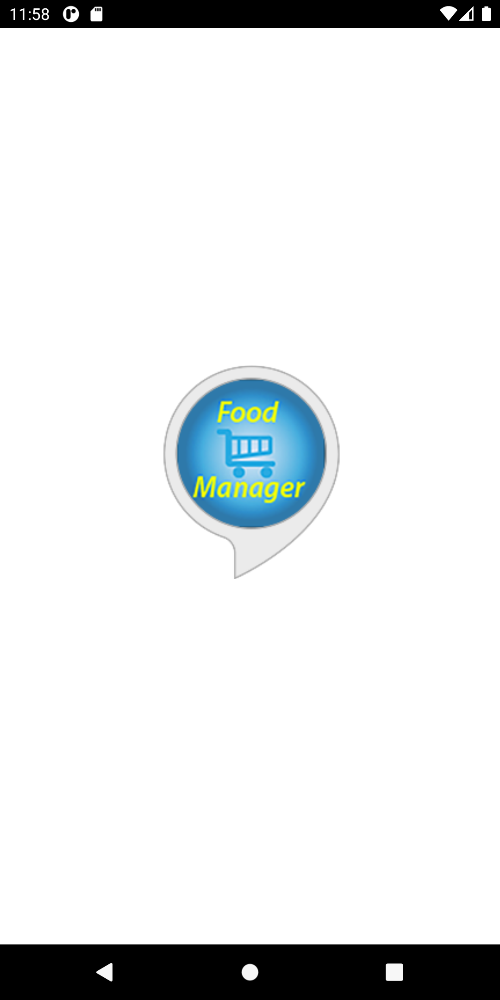 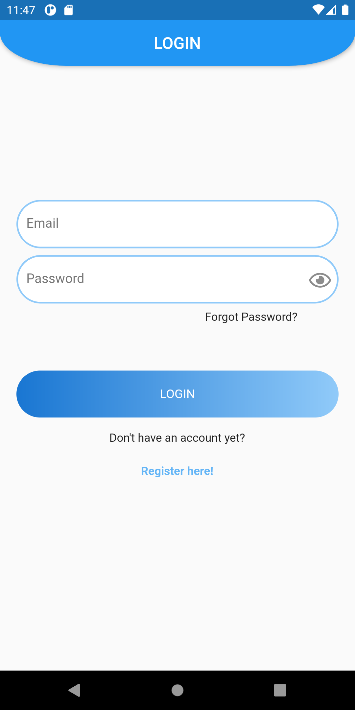 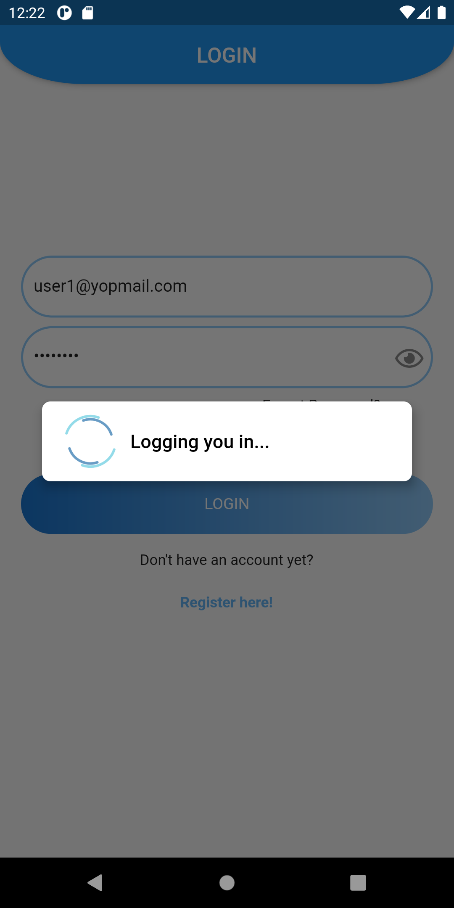 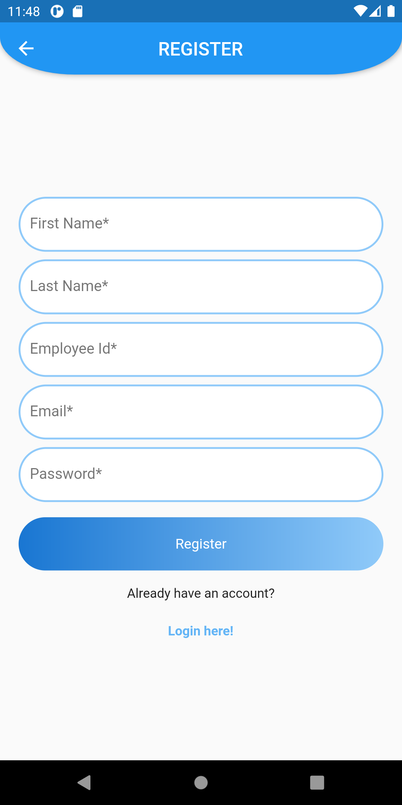

Food Vendor Screens
====
### 1. Vendor can Scan the QR code and book the meal of user.
### 2. Vendor can see all bookings with booking ID and can approve payment status.
### 3. Vendor can see PriceList of all available items.
### 4. Vendor profile is also available.

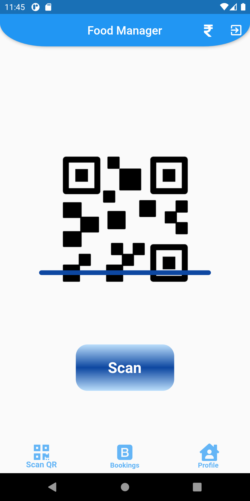 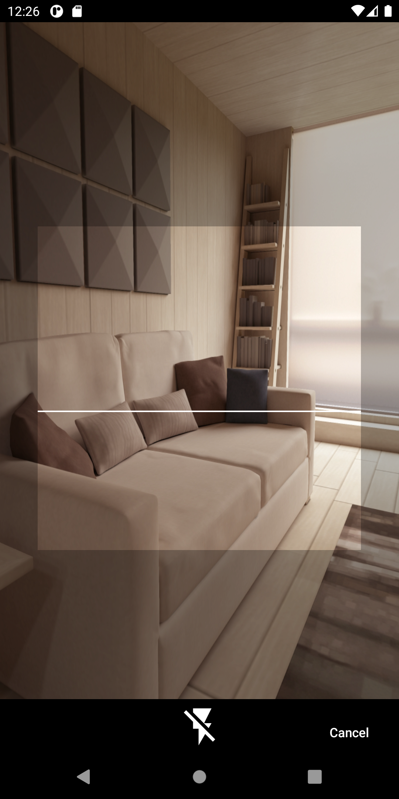 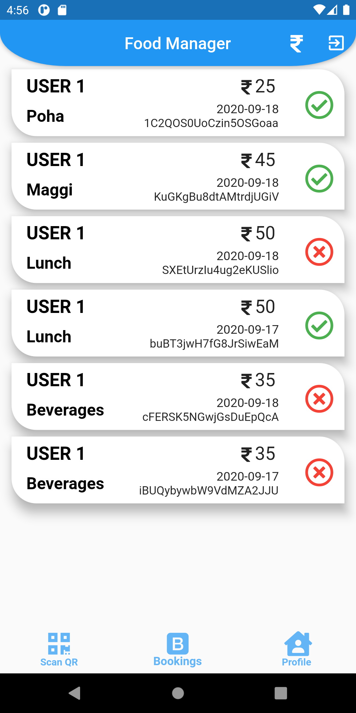 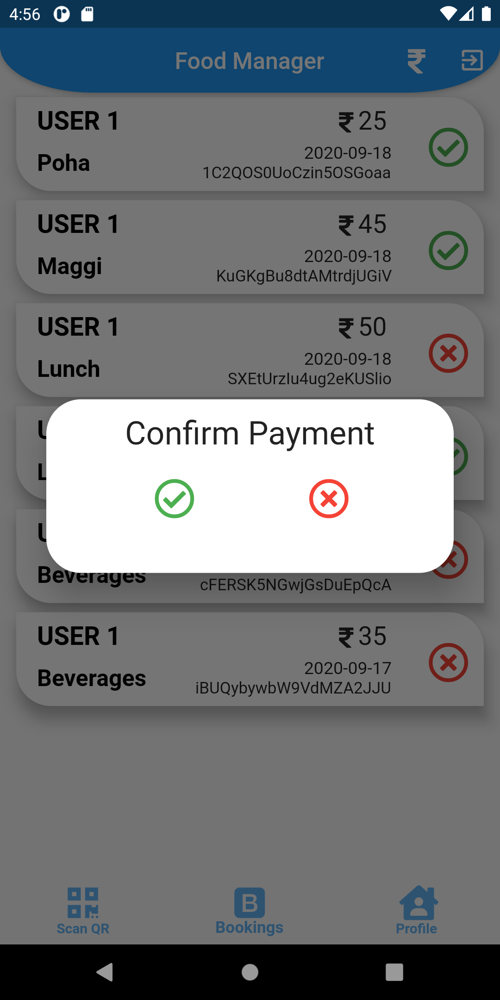 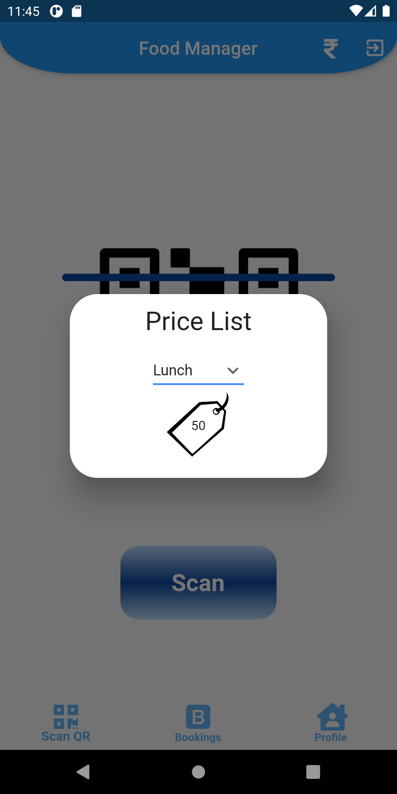

User Screens
====

### 1. User can See payment status of their bookings by using filter icon on AppBar
### 1. User can See bookings with unique booking ID and other details.
### 1. User can Generate QR code for all meal types and only one booking of an item is granted for a single day.
### 1. User profile page.

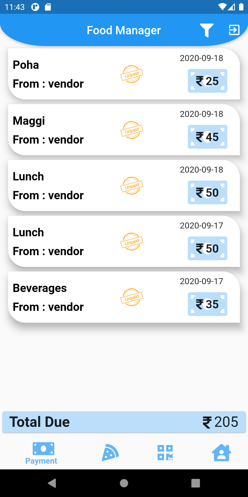 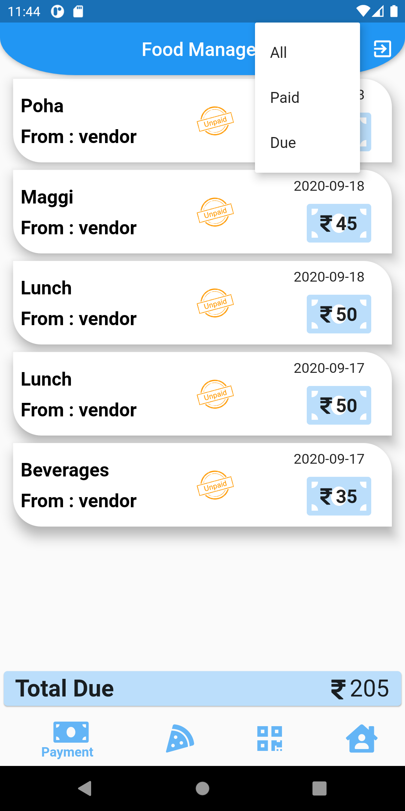 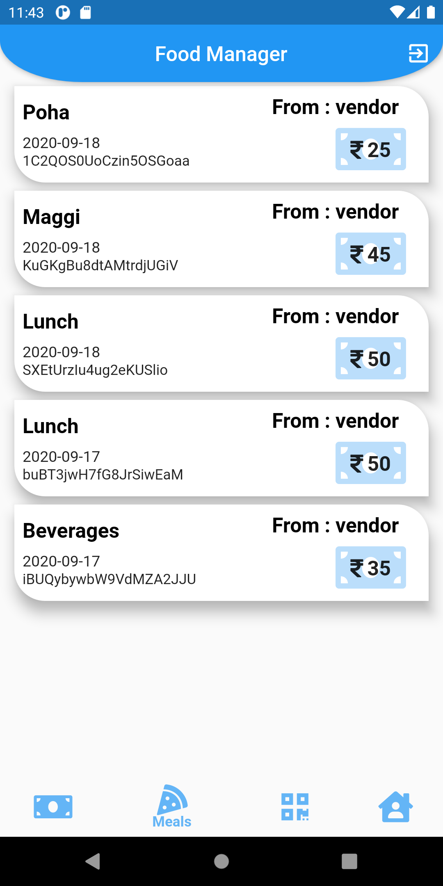 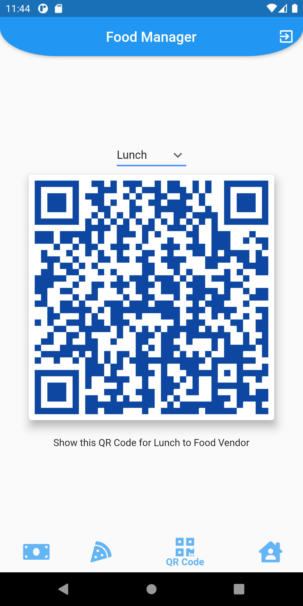 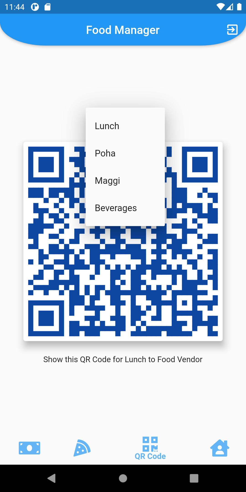

Admin Screens
====
### 1. Admin can see list of all type of registered users.
### 2. Admin can check profile of all registered users.

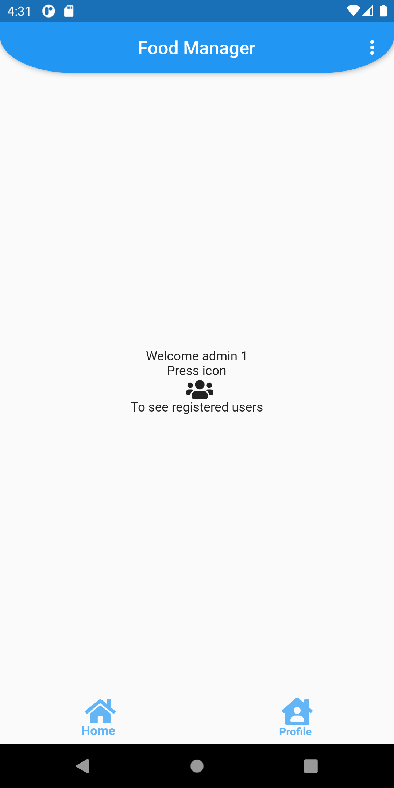 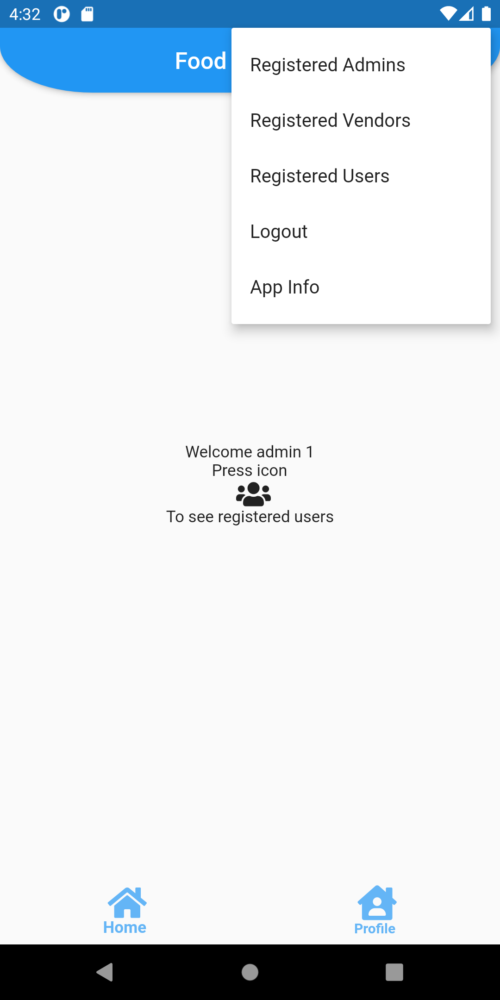 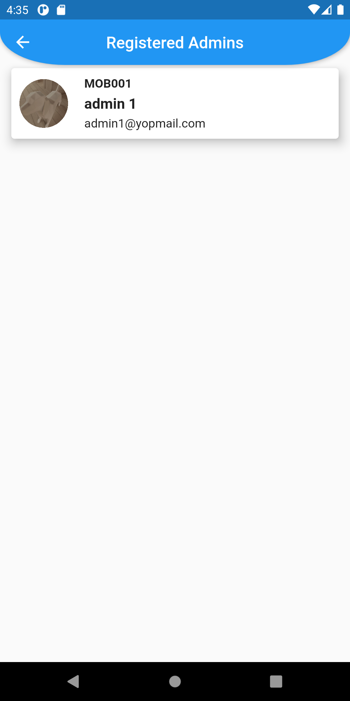 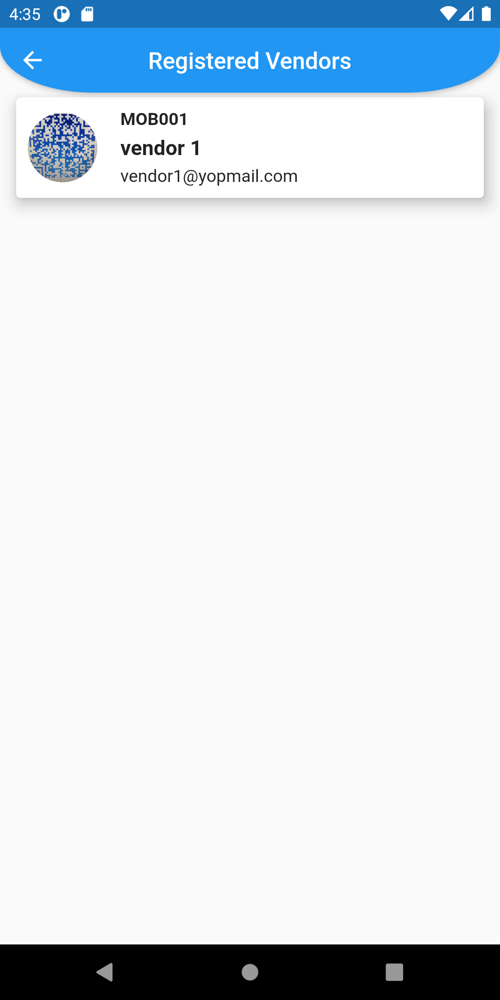 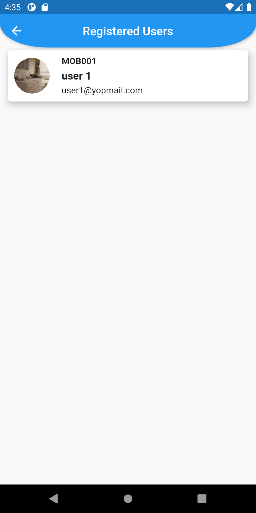

Profile Screens
====
### 1. Profile Screen will display Name, Job Title, Employee Id, Email Id, and profile picture
### 2. Profile picture, First Name, Last Name, and Job Title are editable.

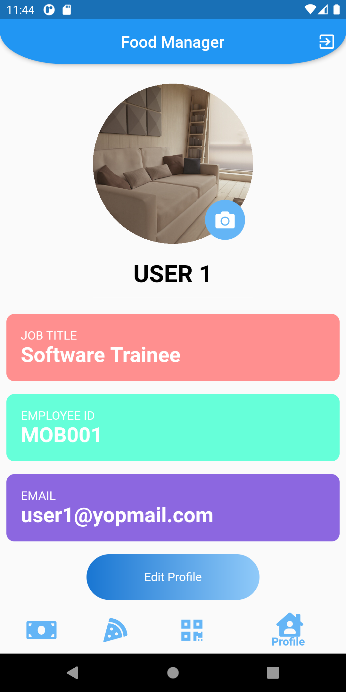 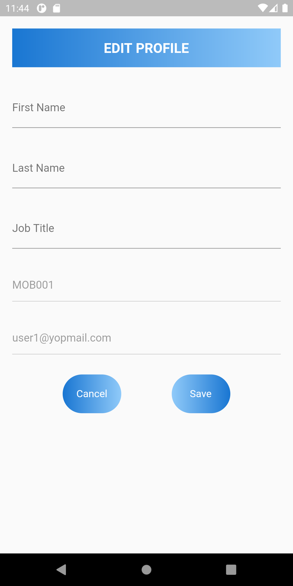

Firebase Configuration
====
You need to configure your Android & iOS app on Firebase and use Cloud Firestore DB.
[Firebase Console](https://console.firebase.google.com) 

Contributors
====
Contribution by [Neeraj Kumar Maurya](https://github.com/neerajmaurya250) & [Ravi Shankar Singh](https://about.me/itsravishankarsingh)

